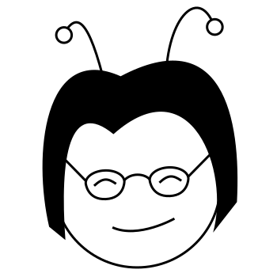

 If you can portray her better, feel free.
# Auntie Nae (antennae)
A library and protocol for peer-to-peer WebRTC signaling using the WebPush Protocol + API.  It enables P2P applications to be built without running a signaling server: the browser vendor's push notification servers are used.  In fact, a dynamic, P2P, webapp can be created with only static hosting giving censorship resistance and ease of use.

## Censorship Resistance
An adversary should be unable to disrupt the network.
* There's no single server to block: Each browser vendor has their own push notification network and this library uses whichever one is built into the browser.
* Only static hosting: Static hosting is easy to find and a webapp can be migrated quickly.  In the future the app may be able to be shared directly between peers using Web Packages.

## Ease of Use
Most P2P networks require installing special software.  This library opens up P2P applications to people by them simply openning a website.  Other P2P webapp libraries (like webtorrent) have inequal peers.  There are crossover peers that speak both webrtc and bittorrent.  The network couldn't run without those peers.  With Antennae, all peers are equal and can bootstrap off of eachother - even two browser peers.  Nothing is lost here, over traditional peer to peer networks either - a non browser peer with a public ip address can act as its own push notification server and thus be independent from all the browser vendor's networks.  A non browser peer without a public IP address, or a browser peer that doesn't support push notifications (cough, cough, Safari, cough, cough) can use the public endpoints for Mozilla's push network.  Hopefully we will be able to reverse engineer the endpoints for Google Chrome (and future push networks) to increase the diversity / resilience for these peers.